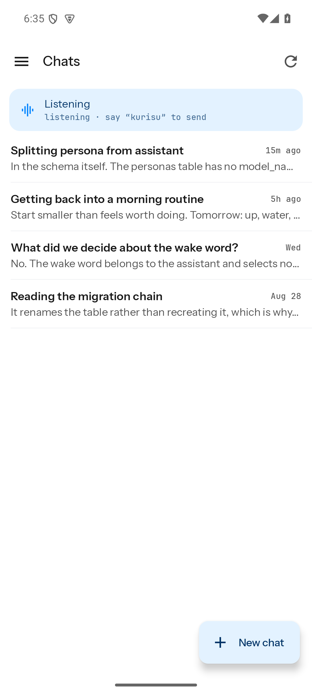
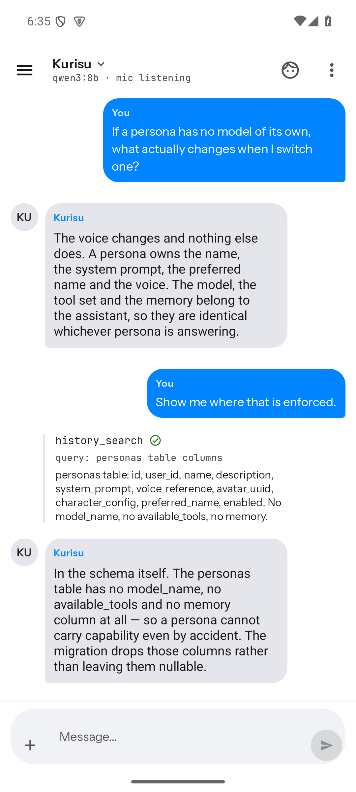
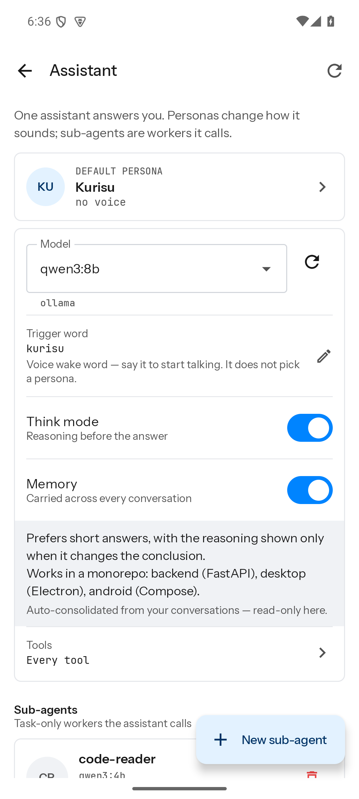

# Kurisu Assistant


Kurisu Assistant is a personal AI assistant for text and voice conversations. One assistant per account owns the model, tools and memory; you give it as many personas as you like — a name, a personality, a voice and a face — and pick which one answers. It also supports persistent conversations and memory, image input, speech recognition, text-to-speech, tools, skills, and animated characters.

The project is split into a server and two clients. Pick the guide that matches what you want to do:

| Guide | For | Start here |
| --- | --- | --- |
| [Set up your own server](#set-up-your-own-server) | Starting a server and connecting a client | Deployment tutorial |
| [Backend](backend/README.md) | Running your own server | Docker setup, providers, data, backups |
| [Desktop client](clients/desktop/README.md) | Windows and Linux users | Install, sign in, chat, voice, tools |
| [Android client](clients/android/README.md) | Android users | Install the APK, permissions, mobile voice |

Each package documents itself. For pictures of the apps, see
**[Android screens](clients/android/docs/screens.md)** and
**[Desktop screens](clients/desktop/docs/screens.md)**; for the model behind them —
one assistant, its personas, and the sub-agents it calls — see
**[assistant architecture](backend/docs/agents.md)**.

| | | |
| --- | --- | --- |
|  |  |  |
| Conversations, labelled by the persona answering | A tool call, shown as a rail | One assistant: model, tools, memory, wake word |

## Quick start for users

You need a Kurisu Assistant server URL and an account. If someone else hosts the server, ask them for both. To host it yourself, follow [Set up your own server](#set-up-your-own-server) below.

1. Install the [desktop client](https://github.com/Khoality-dev/KurisuAssistant-Client-Desktop/releases/latest) or [Android client](https://github.com/Khoality-dev/KurisuAssistant-Client-Android/releases/latest).
2. Open the app and enter the complete server URL, including `http://` or `https://`.
3. On a fresh self-hosted server, register in the app, then ask the server operator to activate your account before signing in.
4. On desktop, open **Settings → Assistant**; on Android, open **Assistant** from the drawer. Select a model. The first message fails until a model is selected.
5. Keep the default persona or create one using the client-specific guide, then start chatting. Grant microphone or camera permission only when you want those features.

On a physical Android phone, `localhost` means the phone itself. Use the server computer's LAN address or public hostname instead.

## Set up your own server

Install Docker Engine and Docker Compose, and allow about 15 GB of free disk
space. The text-chat server does not need a GPU. You also need Ollama or an API
key for Google Gemini, NVIDIA NIM, or Poe.

Download this repository, open a terminal in its root folder, and run:

```bash
cd backend
cp .env.template .env
docker compose up -d
```

The first start downloads several gigabytes. When it finishes, open
<http://localhost:15597/health> on the server computer. A working server shows:

```json
{"status":"ok","service":"llm-hub"}
```

Follow the quick start above, using `http://localhost:15597` on the server
computer or `http://<server-address>:15597` on another device. Register in the
app, then activate the account by running this from `backend/`, replacing
`name` with its username:

```bash
docker compose exec -T postgres sh -c 'psql -U "$POSTGRES_USER" -d "$POSTGRES_DB"' <<'SQL'
UPDATE users SET is_active = true WHERE username = 'name';
SQL
```

The user can now sign in.

For a cloud model, add its API key under **Settings → Account**. For Ollama,
leave the default URL if it runs on the server computer; on Linux, start it with
`OLLAMA_HOST=0.0.0.0 ollama serve` so Docker can reach it. Then select and save
a model under **Settings → Assistant** on desktop or **Assistant** in the
Android drawer before sending your first message.

### If it does not work

- **Cannot connect:** open `/health` with the same host and port; on a phone, replace `localhost` with the server's LAN address.
- **No models appear:** check that Ollama is reachable from Docker, or save a valid cloud provider key and refresh the model list.
- **The first message fails:** select and save a model under **Assistant**.
- **The account is not activated yet:** ask the server operator to activate it using the command above; waiting accounts are listed in the API startup log.
- **The server does not start:** from `backend/`, run `docker compose logs api` and check the first reported error.

For backup, restore, updates, and removal, see [server operations](backend/docs/operations.md).

## Shared first-run checklist

After signing in, configure at least one model provider under **Settings → Account**. Both clients support Ollama, Google Gemini, NVIDIA NIM and Poe; enter a provider's API key there and its models appear in the model pickers.

Your account already has one assistant and one persona. Select the assistant's model, and optionally its tools, memory and voice wake word — those belong to the assistant, so they do not change when you switch persona. Then give the persona (or a new one) a personality, voice and avatar. A new conversation silently uses your default persona; the chat header switches persona for one conversation.

For voice conversations, select an ASR language/model and TTS backend, then enable **TTS Auto-Play**. Enable **Always Listen** only when you want the microphone kept active for trigger words or dictation. Available models and voices depend on the services installed on the server.

## Common safety notes

- A fresh self-hosted server has no default account or password; registered accounts must be activated by the server operator.
- Treat login QR codes and API keys like passwords.
- Only enable tools you trust. Desktop host tools can access files or run commands within paths allowed under **Host Access**.
- Back up the database, `data/`, and `.env` together by following [Server operations](backend/docs/operations.md).

## Troubleshooting

- **Cannot connect:** check the complete URL, port, network reachability, and whether Android is incorrectly using `localhost`.
- **No models:** verify the provider URL/key from the backend's point of view, then save settings and refresh models.
- **Voice fails:** grant microphone permission, choose an ASR/TTS model, and ask the server operator to check service logs.
- **Tool fails:** confirm the tool server passes its connection test, the assistant or sub-agent is allowed to use the tool, and any approval prompt is accepted.

For setup checks, see [If it does not work](#if-it-does-not-work).

See the [backend documentation](backend/docs/) for API, WebSocket, speech, vision, tools, and development details.

## License

MIT. See [LICENSE](LICENSE).
