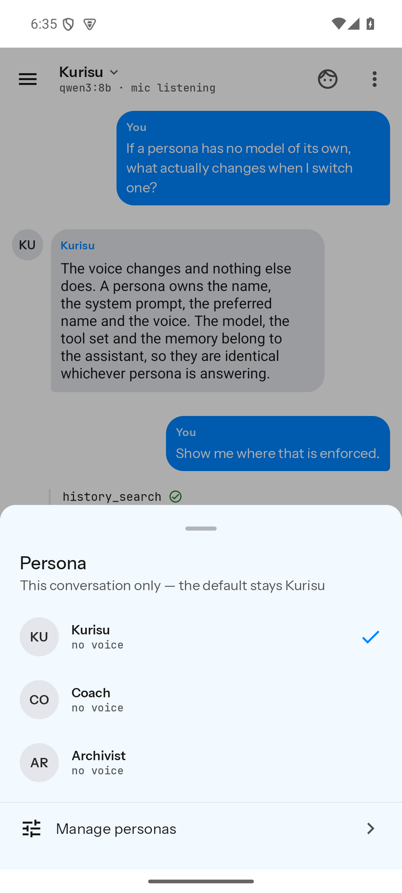
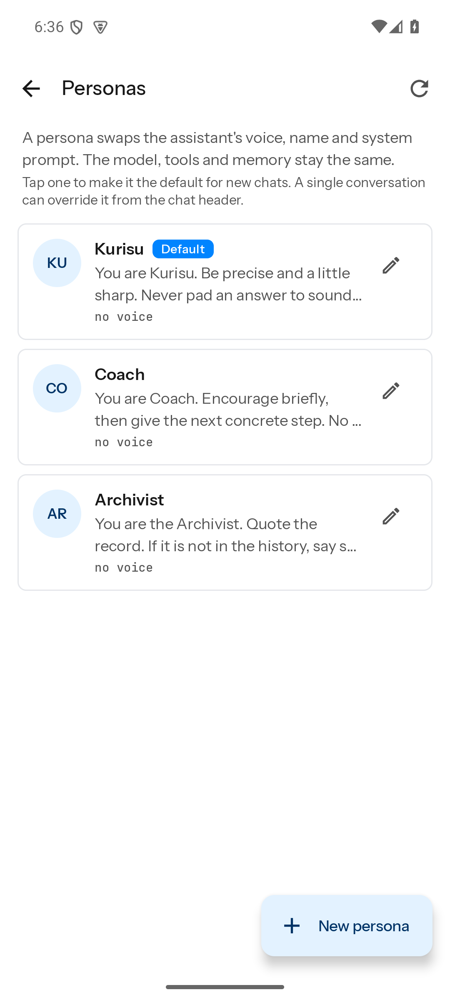
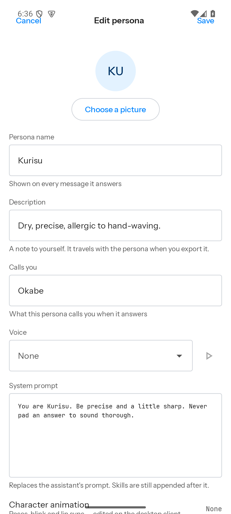
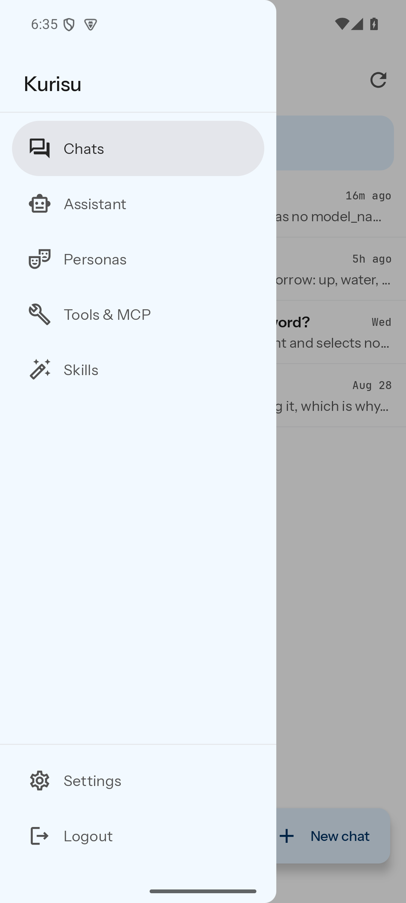
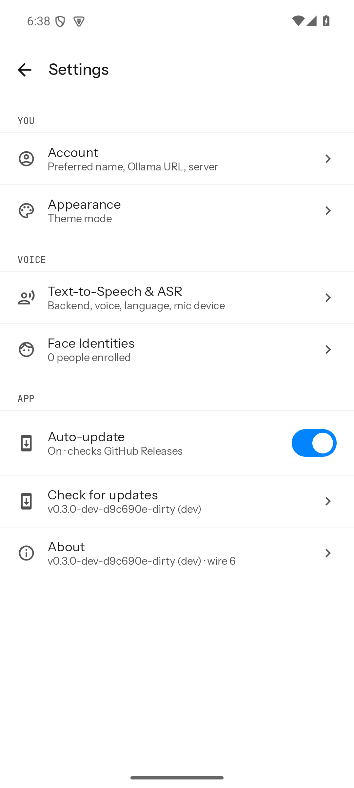
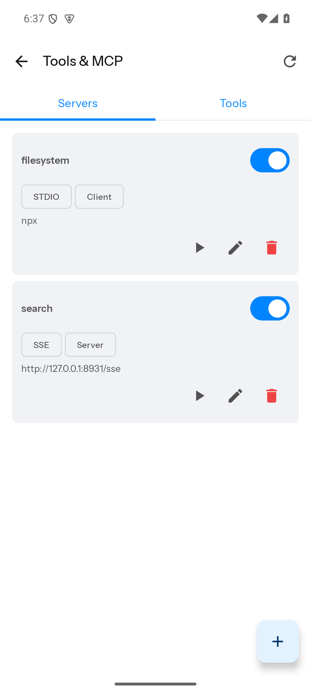
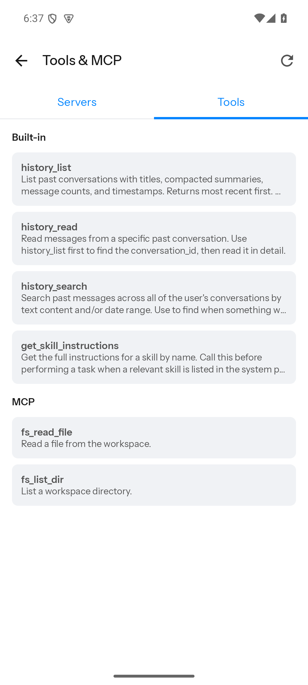
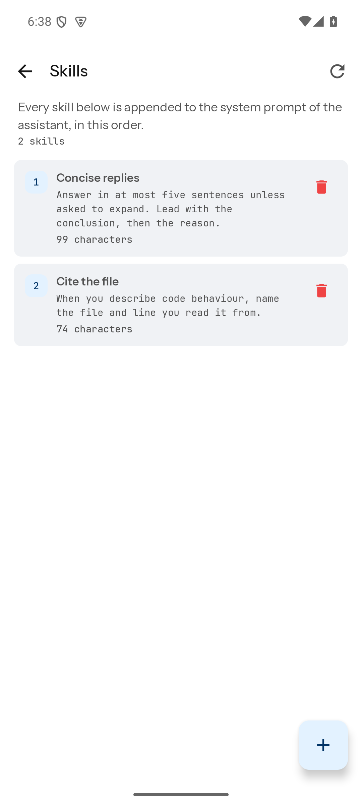
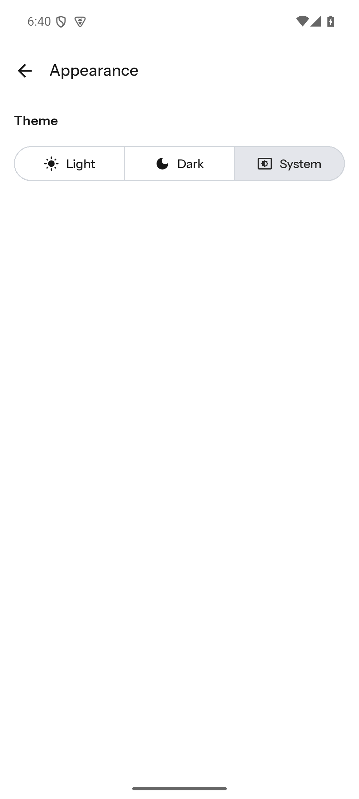

# Android screens

What the app looks like, and the model it presents.

Every screenshot here is generated from fixture data — invented personas, invented
transcripts — never from a real install. See [Regenerating these](#regenerating-these).

For the model itself, and how it is stored, see [Agents](../../../backend/docs/agents.md) in the
backend docs. The short version: a **persona** is how the assistant sounds, the **assistant** is
what it can do, and switching persona changes who answers without changing the model, the tools or
the memory.

---

## Chats


Conversations are what you navigate. A row is its title, when it last moved, and the last thing said
in it. Neither the persona nor the model is on it: there is one assistant with one default persona,
so a face and a name would be the same face and the same name on every row and would tell no two
rows apart (#192). Who answers a conversation is on the conversation, in its header.

The strip at the top is voice state. The wake word (`kurisu` here) belongs to the **assistant**, not
to any persona: saying it starts a turn, and whichever persona the conversation is bound to answers.

## A conversation


The header names the **persona**; the assistant's model sits on the line beneath it. Each answer
carries the persona that produced it, so switching persona part-way through does not rewrite the
past — old answers keep the voice that actually gave them.

A tool call is a rail rather than a bubble: name, arguments, result, status. A step delegated to a
sub-agent is tagged `sub-agent` and names the model that ran it.

## Switching persona for one conversation



Tapping the header swaps the persona **for this conversation only**. The account default is
untouched, and the change persists without sending a message.

## Assistant


One screen for everything the assistant can do. The default persona is the one every new
conversation silently starts with — there is no picker on **New chat**. Memory is a single document,
consolidated automatically from your conversations and read-only here. Sub-agents sit at the bottom,
because they are workers this assistant calls rather than something you chat with.

## Personas

| | |
| --- | --- |
|  |  |

A persona carries presentation only — there is no model, no tool list and no wake word in the
editor. "Calls you" is what the persona calls *you*, not a display name for the persona.

## Everything else

| | |
| --- | --- |
|  |  |
| Navigation | Settings |
|  |  |
| MCP servers, by transport and location | Tools, split built-in from MCP |
|  |  |
| Skills, appended to the assistant's prompt | Light / dark / system |

---

## Regenerating these

The app is driven against the **standalone mock backend** from the desktop package — never a
deployed one (the rule in `CLAUDE.md`).

**Every picture on this page comes from `--scenario docs`.** That one scenario furnishes all of
them: three personas, the assistant and its memory, two sub-agents, two MCP servers, the built-in
tool descriptions, two skills, and four conversations of different ages — one of which carries the
transcript and the tool rail above. Any other scenario gives an app with nothing in it: before #195
the mock's `/skills` was a hardcoded empty list and `/models` only ever offered `test-model`, so
these pictures could not have come from it and did not. The other scenarios (`tool-call`,
`sub-agent`, `handoff`, …) script a *stream*, and are for watching one arrive; see
[`../../apps/desktop/docs/testing.md`](../../apps/desktop/docs/testing.md#the-standalone-mock).

```bash
# 1. The mock, reachable from the emulator (10.0.2.2 is its route to the host).
#    Dependencies install at clients/ and nowhere else, so npm ci runs there.
cd clients && npm ci
cd apps/desktop && npm run mock:backend -- --host 0.0.0.0 --port 15597 --scenario docs

# 2. Any username and password sign in. Everything the pictures show is already
#    there — no message needs sending.

# 3. A headless emulator
emulator -avd <avd> -no-window -no-audio -no-boot-anim -gpu swiftshader_indirect
./gradlew :app:assembleDevDebug
adb install -r -g app/build/outputs/apk/dev/debug/*.apk

# 4. Point the app at http://10.0.2.2:15597, sign in, then drive and capture.
adb shell uiautomator dump /sdcard/ui.xml   # element bounds, to tap precisely
adb exec-out screencap -p > shot.png
```

Two things that cost time when they are wrong:

- `tool_status` on a scripted tool chunk must be one of `success`, `error` or `denied`. Anything
  else falls through to "running", which looks like a UI bug and is not one.
- The emulator's software GPU is slow enough to raise "System UI isn't responding". Dismiss it and
  carry on; it is not the app.
