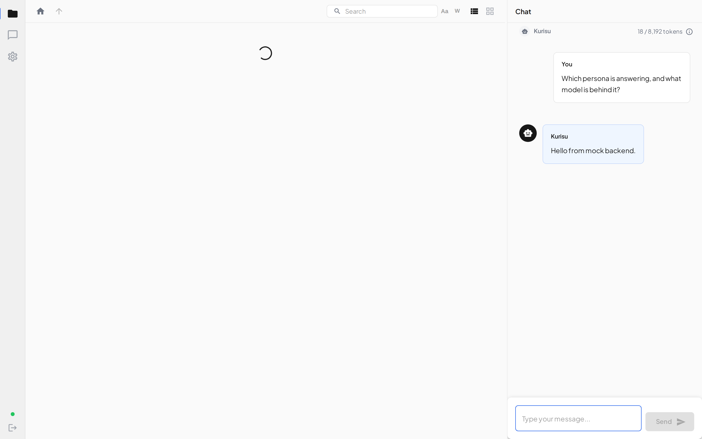
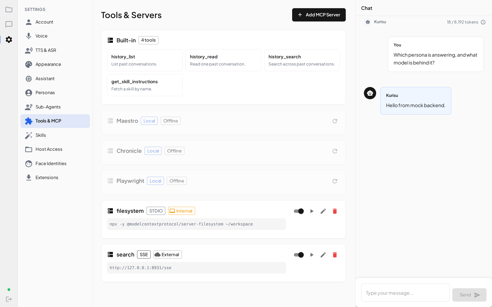

# Desktop screens

What the app looks like, and the model it presents.

Every screenshot here is generated from the mock backend in
[`tests/mock/server.ts`](../tests/mock/server.ts) — invented personas, invented transcripts, never a
real install. See [Regenerating these](#regenerating-these).

For the model itself, and how it is stored, see [Agents](../../../backend/docs/agents.md) in the
backend docs. The short version: a **persona** is how the assistant sounds, the **assistant** is
what it can do, and switching persona changes who answers without changing the model, the tools or
the memory.

The desktop was not part of the v3 visual redesign — it took the model change only.

---

## Assistant


Where there was a single **Agents** section there are now three, because capability, presentation
and task-only workers are three different resources.

This screen is the capability half: one model, one tool set, one memory. The wake word is a voice
trigger that selects no persona, and the default persona is the one every new conversation silently
starts with.

## Personas


Presentation only — a name, a prompt, a voice, a face. The editor is also the only place
`voice_reference` and `preferred_name` are reachable; neither had a UI before the split.

## Sub-agents


Task-only workers the assistant calls mid-answer. They keep their own model and tools, because they
run their own loop, but they have no identity and never speak to you directly.

## Chat



Each answer is labelled with the persona that produced it. A tool call carries its own name, and a
delegated step is tagged with the sub-agent and the model that ran it.

## Everything else

| | |
| --- | --- |
|  |  |
| Sign in | Tools & MCP |
|  | |
| Skills, appended to the assistant's prompt | |

---

## Regenerating these

The capture renders the built renderer in **headless Chromium**, not Electron. That works because
every use of the preload bridge in the renderer is guarded (`if (!window.electron)` /
`window.electron?.x`) and nothing dereferences it at module scope — and because `package.json` runs
the same `vite` command for `dev` and `electron:dev`, so the renderer is an ordinary web bundle that
Electron merely points a `BrowserWindow` at. The capture installs a stub bridge anyway, so the
screenshots do not depend on those guards staying correct.

```bash
npx vite build
npx playwright test -c playwright.screenshots.config.ts
```

The capture lives in [`tests/screenshots/capture.screens.ts`](../tests/screenshots/capture.screens.ts).
It is deliberately **not** a `*.spec.ts`, and it has its own Playwright config, so
`npm run test:e2e` never picks it up.

If you want the real Electron window instead — including the OS chrome — install `xvfb` and run the
e2e path the way CI does (`xvfb-run -a`, see `.github/workflows/desktop-test.yml`). Electron cannot
run without a display.
