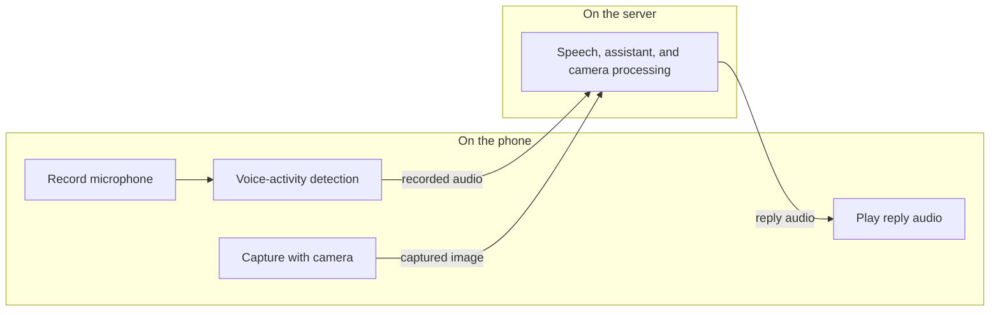

# Android app

The Android client requires Android 8.0 (API 26) or newer. Complete [First run](first-run.md) before troubleshooting chat.

## Install and connect

Download the latest APK from the [Android releases page](https://github.com/Khoality-dev/KurisuAssistant-Client-Android/releases/latest). Open it and allow installation from your browser or file manager if Android asks.

By default, Android's in-app updater gets updates from that GitHub repository. Those releases come from an update source separate from the server operator.

The default server URL is `http://localhost:15597`. On a phone, `localhost` is the phone, not the server. Enter `http://<server-LAN-address>:15597` or the hostname supplied by the operator.

You can enter a username and password or scan a QR code generated by the desktop app under **Settings → Account**. The QR contains the username and password in plain text; treat it as a credential.

## Find your way around

The drawer entries are, in order: **Chats**, **Assistant**, **Personas**, **Tools & MCP**, **Skills**, then **Settings** and **Logout**.

The dedicated configuration screens are titled **Account**, **Appearance**, **Skills**, **Tools & MCP**, and **TTS & ASR**. The **Settings** index also links to **Face Identities**, update controls, and **About**.

Open **Chats** to resume a conversation. Open **Personas** to choose or edit who answers. The **Assistant** screen owns the model, tools, memory, wake word, and sub-agents.

Typing `/` in chat offers `/clear`, `/delete`, `/resume`, `/context`, `/persona`, `/refresh`, and `/compact`. There is no `/agents` command.

Grant microphone permission for voice, camera permission for QR scanning and face capture, and package-install permission for an in-app update.

Recording, voice-activity detection, playback, and camera capture happen on the phone. When you use the corresponding feature, the recorded audio or captured image is sent to the server for processing.

## Camera limitation

The server's YOLO body-pose stage explicitly requires CUDA, and the default stack does not give the API a GPU. Face recognition can fall back to CPU, and MediaPipe hand detection runs on CPU, but the full gesture pipeline will not work on a CPU-only deployment. Text, tools, memory, and speech are unaffected.

See [Voice](voice.md) for speech setup and [Troubleshooting](troubleshooting.md) if the phone cannot reach the server.
