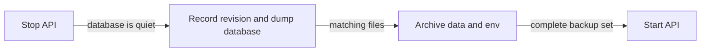
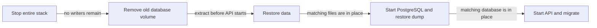

# Backup and restore

Back up the database, `backend/data/`, and `backend/.env` as one unit. Database rows refer to files under `data/`. Mixing a restored database with older files can cause persona asset cleanup to delete files that the restored configuration does not reference.

`data/jwt_secret.key` must also survive. If it is replaced, every signed-in client is logged out.

The backup contains several credential stores. The `data/` archive contains the session-signing key, the database dump contains users' provider API keys in plain columns, and `.env` contains the database password and any server-wide fallback keys. Restrict access to the entire backup directory.

## Ordering





## Back up

Run from `backend/`. Change `/backup` if your backup storage is elsewhere.

```bash
set -a; . ./.env; set +a
OUT=/backup/kurisu-$(date -u +%Y%m%dT%H%M%SZ); mkdir -p "$OUT"
git rev-parse HEAD > "$OUT/commit"
docker compose stop api
docker compose exec -T postgres psql -U "$POSTGRES_USER" -d "$POSTGRES_DB" \
  -tAc 'select version_num from alembic_version' > "$OUT/alembic_version"
docker compose exec -T postgres pg_dump -U "$POSTGRES_USER" -d "$POSTGRES_DB" -Fc > "$OUT/kurisu.dump"
sudo tar -C . -czf "$OUT/data.tar.gz" data
cp .env "$OUT/env"
[ -d nginx/certs ] && sudo tar -C . -czf "$OUT/nginx-certs.tar.gz" nginx/certs
docker compose start api
chmod 600 "$OUT/env" "$OUT/data.tar.gz"
```

The API writes files as root, which is why the archive command uses `sudo`.

With the voice profile, also archive `${VIXTTS_ROOT}/models` and `${UVOICE_ROOT}/data`. With the `sovits` profile, also archive `data/sovits/weights`.

## Restore

This procedure deletes the deployment's current database volume and `data/` directory. Confirm the backup stamp before running it.

The backup's `commit` file records the revision it came from. Restoring into a newer deployment is supported; the API runs migrations forward when it starts. Restoring into an older deployment is not supported. If you are rolling back, check out the recorded commit, or its corresponding release tag, before restoring.

```bash
cd <deployment>/backend
cp /backup/<stamp>/env .env && set -a && . ./.env && set +a
docker compose down
docker volume rm kurisuassistant_postgres-data
sudo rm -rf data && sudo tar -C . -xzf /backup/<stamp>/data.tar.gz
docker compose up -d postgres
until docker compose exec -T postgres pg_isready -U "$POSTGRES_USER" -d "$POSTGRES_DB"; do sleep 2; done
docker compose exec -T postgres pg_restore -U "$POSTGRES_USER" -d "$POSTGRES_DB" \
  --no-owner --clean --if-exists < /backup/<stamp>/kurisu.dump
docker compose up -d --build api && docker compose logs -f api
```

`data/` is restored before the API starts. Reversing those steps creates a new signing key and invalidates existing sessions.

## Verify the restore

- Confirm `data/jwt_secret.key` retains the timestamp from the backup. A fresh timestamp means the API started before the key was restored.
- Confirm the database's `alembic_version` equals the recorded value or a later migration.
- Open a client that was already signed in. It should still work without another login.

Restore the optional voice model directories before testing speech.
