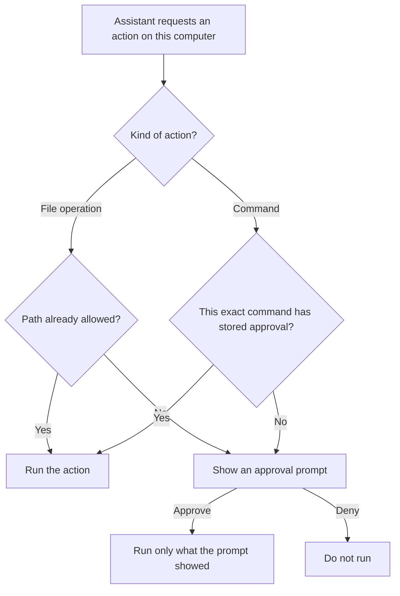

# Desktop app

The desktop client runs on Windows and Linux. Complete [First run](first-run.md) before troubleshooting chat.

## Install and connect

Download the latest installer from the [desktop releases page](https://github.com/Khoality-dev/KurisuAssistant-Client-Desktop/releases/latest).

By default, the desktop app automatically downloads updates from that GitHub repository. Those releases come from an update source separate from the server operator.

- On Windows, run the `.exe` installer.
- On Linux, install the `.deb`, or make the AppImage executable and open it.

Enter the complete server URL on the sign-in screen. The default is `http://localhost:15597`. Use `http://<server-address>:15597` when the server is on another machine.

The settings sections are, in order: **Account**, **Voice**, **TTS & ASR**, **Appearance**, **Assistant**, **Personas**, **Sub-Agents**, **Tools & MCP**, **Skills**, **Host Access**, **Face Identities**, and **Extensions**.

## Conversations and commands

Choose the persona in the chat header. The selection belongs to that conversation; it does not create a different assistant.

Typing `/` shows these commands: `/clear`, `/delete`, `/resume`, `/context`, `/persona`, `/refresh`, `/compact`, `/live-animate`, and `/vision`.

There is no `/agents` command.

## QR sign-in

Open **Settings → Account**, choose **Show login QR**, and re-enter your password. Android can scan the result.

The QR payload contains the server URL, username, and password in plain text. It is a credential: do not save or share a screenshot of it.

## Code and file access on this computer

**Host Access is a security boundary.** A file call runs only when its path is already allowed or you explicitly approve the displayed path for that call. A stored tool approval cannot authorize an unrelated path. A permanent approval grants the exact selected path; granting a directory includes its subtree.

Bash approval is per complete command. Permanently approving `git status` approves no other command.

Starting a local MCP server prompts first and shows the exact command line. **Start Playwright automatically** is off by default under **Settings → Tools & MCP**.

The desktop app also exposes its own MCP server on `127.0.0.1`. External clients must send the bearer token shown under **Settings → Tools & MCP**. Anyone with that token can run commands on this machine. Rotate it if it is exposed.

Sign-in tokens are stored in the operating-system keychain. If no keychain is available, **Remember me** is disabled and the session ends when the app closes.

See [Tools and skills](tools-and-skills.md) before enabling capabilities you do not recognize.

## Camera limitation

`/vision` uses the server camera pipeline. Its YOLO body-pose stage explicitly requires CUDA, and the default stack does not give the API a GPU. Face recognition can fall back to CPU, and MediaPipe hand detection runs on CPU, but the full gesture pipeline will not work on a CPU-only deployment. Text, tools, memory, and speech are unaffected.

See [Voice](voice.md) for microphone and speech setup.
