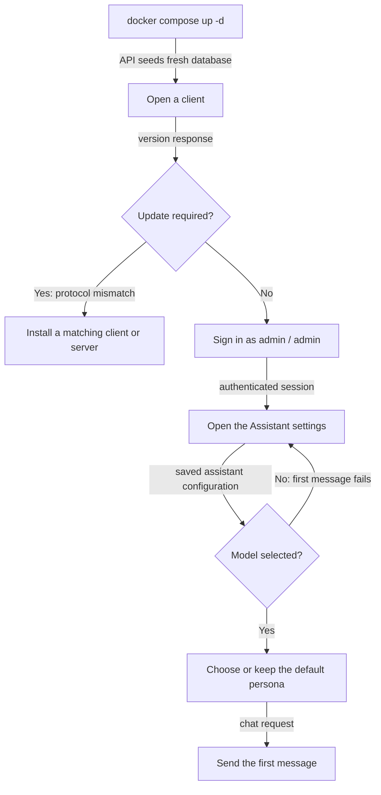
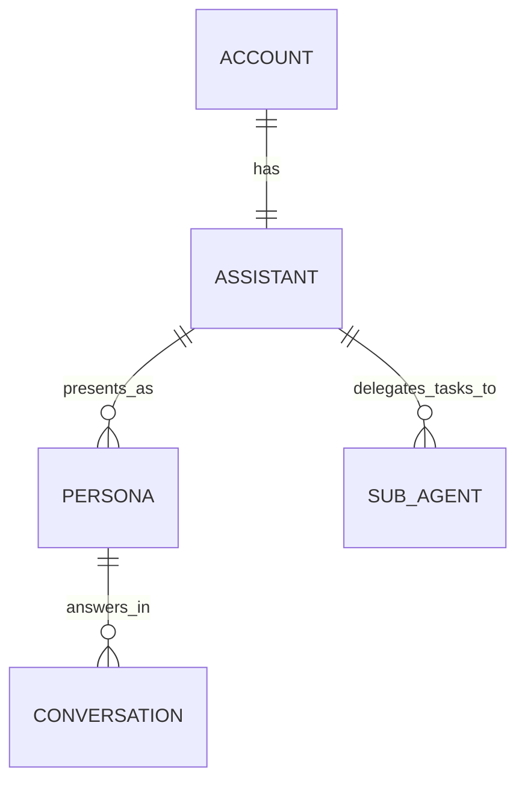

# First run

The database is created and migrated when the API container starts. Do not run a database setup command by hand.

## From startup to first message



1. Sign in with username `admin` and password `admin`.
2. On desktop, open **Settings → Assistant**. On Android, open **Assistant** from the drawer. Select and save a model. **The first message fails if you skip this.**
3. Keep the seeded persona or choose another, then start a chat.

See [Desktop](desktop.md) or [Android](android.md) for the client controls.

## Important security limitation

There is currently no endpoint, command, or client control for changing the seeded `admin` password. The server logs a warning while `admin` / `admin` remains in place.

Do not put a fresh server on an untrusted network. Registration being closed does not protect the public default account.

## Accounts, assistants, and personas



Each account has one assistant. Its model, tools, memory, and wake word apply whichever persona is speaking. Personas provide the name, prompt, voice, avatar, and character graph. Sub-agents are task-only workers with their own models. Each conversation is bound to one persona.

## Registration and login limits

Registration is closed by default, although both clients show a **Register** tab. If registration reports that it is closed, sign in as `admin` or ask the operator to enable it. The operator can set `ALLOW_REGISTRATION=true` in `backend/.env` and run:

```bash
docker compose up -d
```

Login is limited to 10 attempts in 5 minutes per client address. Further attempts return HTTP 429 until the window clears.

## Run the server for more than one person

There is no invitation flow or admin screen. The only way to create another account is for the operator to set `ALLOW_REGISTRATION=true` in `backend/.env`, run `docker compose up -d` from `backend/`, let the person register, then set it back to `false` and run the command again.

**There is no admin role.** The account named `admin` is an ordinary account and is privileged in name only. Every account can see and change only its own data.

A server-wide provider key in `.env` can be spent by every account on the server, even when that provider does not appear in a user's model picker. On a shared server, prefer having each person store their own provider key under **Settings → Account**.

## “Update required”

The current backend and both current clients use wire protocol 4. If the numbers differ, the client shows **Update required**. That screen has no route back to login or settings. Install a matching client, or have the operator deploy a matching backend.
