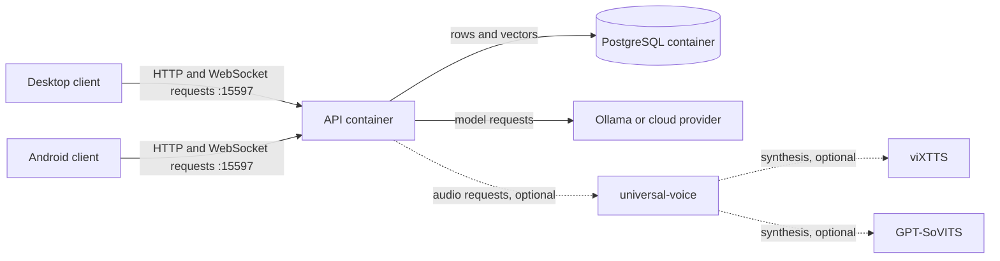

# Install the server

This page is for the person running Kurisu Assistant for themselves or a household.

## Requirements

- Docker Engine 24 or newer.
- Docker Compose v2.24 or newer. The Compose files use `name:`, profiles, and `!override`.
- About 15 GB of free disk space for text chat. The API image is about 10.8 GB and PostgreSQL about 0.5 GB.
- No GPU for text chat, tools, or memory.

A full local speech installation needs an NVIDIA GPU with the NVIDIA container runtime and closer to 40 GB free. Its two images are about 10.3 GB and 11.1 GB, before model caches. See [Voice](voice.md).

The API downloads more weights when features first run. These include the MediaPipe hand landmarker and InsightFace data stored under `data/`.

## How the pieces fit



The normal stack contains only the API and PostgreSQL. The model provider is outside the stack. Speech services are optional.

## Start a text-only server

From the repository root:

```bash
cd backend
cp .env.template .env
```

Edit `.env`. Set all five `POSTGRES_*` values. They are the only required settings.

Then start the stack:

```bash
docker compose up -d
curl localhost:15597/health
```

The response should be:

```json
{"status":"ok","service":"llm-hub"}
```

Two containers are now running: the API and PostgreSQL. Clients connect to `http://<server-address>:15597`.

Continue with [First run](first-run.md).

## Settings you may want to change

Settings live in `backend/.env`; the template explains the full set.

- `ALLOW_REGISTRATION` controls whether people can create accounts. It is off by default.
- `API_PORT` and `API_BIND` control the published HTTP port and interface. Defaults are `15597` and `0.0.0.0`.
- `LLM_API_URL` points to Ollama. Its default, `http://host.docker.internal:11434`, reaches Ollama on the server host.
- `GEMINI_API_KEY`, `NVIDIA_API_KEY`, and `POE_API_KEY` are optional server-wide fallbacks. A key saved by a user under **Settings → Account** takes precedence.
- `HTTPS_PORT` controls the optional TLS listener and defaults to `443`.

After changing `.env`, apply it with:

```bash
docker compose up -d
```

### Ollama on Linux

Docker Desktop on macOS and Windows can reach the normal host Ollama setup. A stock Linux Ollama listens only on `127.0.0.1`, so the API container cannot connect to it. Start Ollama with:

```bash
OLLAMA_HOST=0.0.0.0 ollama serve
```

For a service installation, set `OLLAMA_HOST=0.0.0.0` in the Ollama systemd unit. Restrict access with the host firewall if the Ollama port must not be available to the rest of the LAN.

No minimum Ollama server version is declared. The backend uses client library 0.6.1 and sends tool definitions, a thinking flag, and `num_ctx`. Old servers or models without tool support may behave unexpectedly. A missing Ollama model is downloaded automatically on its first chat request, so that first message can take a long time.

## Optional TLS

Generate a self-signed certificate once, then start the TLS profile:

```bash
./nginx/generate-certs.sh
docker compose --profile tls up -d
```

To include the server's LAN address in the certificate:

```bash
LAN_IP=192.168.1.20 ./nginx/generate-certs.sh
```

Both clients accept the self-signed certificate. Consider setting `API_BIND=127.0.0.1` so the plain HTTP port is not exposed when nginx is in front.

### What the bundled TLS protects

Encryption is not the same as authentication here. Both clients accept **any** certificate for **any** hostname: the desktop client does this through Electron's certificate-error handler, and Android installs a trust-everything manager. This is what allows the bundled self-signed certificate to work without installing it on each device.

The bundled TLS profile prevents passive listening by someone on the same network. It does not protect against an attacker who can redirect the connection, because that attacker can present another certificate and either client will accept it.

The bundled nginx listens only on port 443. It has no port-80 listener or HTTP-to-HTTPS redirect. With `API_BIND=127.0.0.1`, `http://<host>` does not answer at all; connect with `https://<host>`.

For a server exposed to the public internet, use a real certificate and a proxy you configure yourself instead of the bundled TLS profile.

## Update the server

**Back up the installation first.** The API runs database migrations when it starts, and those migrations are forward-only. Follow [Backup and restore](backup-and-restore.md) before updating.

A backend release is a `backend-vX.Y.Z` git tag on `main`. From `backend/`, deploy the chosen release with:

```bash
git fetch --tags
git checkout backend-vX.Y.Z
docker compose up -d --build
```

The rebuild ships the new backend code. Running `docker compose up -d` without `--build` reuses the old API image.

**If the release changes the wire protocol number, update every client first.** Once the backend moves ahead, an installed older client displays **Update required**, and that screen has no way back. `GET /version` reports the protocol number as `wire_protocol` alongside `backend_version`.

PostgreSQL is pinned to `pgvector/pgvector:pg16`. Changing that image tag to a newer PostgreSQL major version is not an upgrade procedure: the new server refuses to start with the old data directory. To change major versions, use the [backup and restore procedure](backup-and-restore.md), placing the different database image between the dump and reload.

## Stop or remove the server

Run these commands from `backend/`:

- `docker compose stop` stops the containers and preserves everything.
- `docker compose down` removes the containers and preserves the named volumes.
- `docker compose down -v` **deletes the database volume** named `kurisuassistant_postgres-data`. This removes every account, conversation, and memory.

`docker compose down -v` does not remove `backend/data/`, which contains images, avatars, voices, and the session key. The result is a half-deleted installation rather than a clean reset.

To remove the entire installation, run the following from the repository root:

```bash
cd backend
docker compose down -v
cd ..
sudo rm -rf backend/data
```

The API writes `backend/data/` as root, which is why the second command uses `sudo`. **This complete removal is irreversible.**
