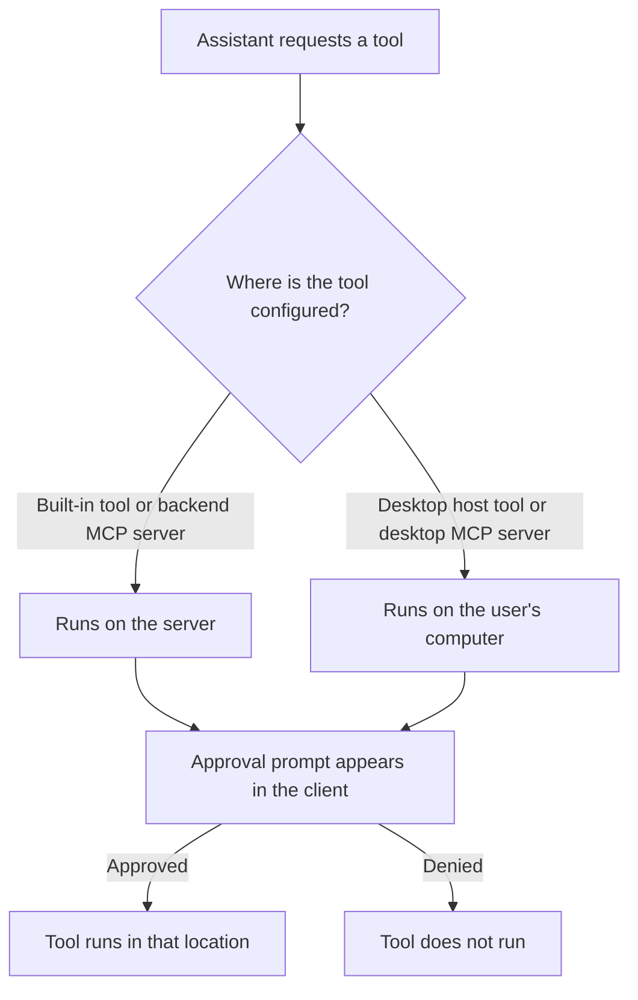

# Tools and skills

Tools let the assistant take actions. Skills are saved instruction blocks that tell it how to perform a kind of task. A skill does not grant access to a tool.

The approval appears in the client whichever machine will run the tool. Check the prompt before approving it; approval does not move a server tool to the desktop or a desktop tool to the server.

## Choose tools

Open **Assistant** and review its tool selection. This selection applies to every persona. Sub-agents are task-only workers and have their own model and tool selection.

Open **Tools & MCP** to inspect built-in tools and configure Model Context Protocol (MCP) servers. A server can be remote, run with the backend, or be a local process on the desktop. Use its test control before relying on it in chat.

Enable only tools and MCP servers you trust. A tool may send data to another service or change data. Desktop tools can also read files and execute commands, subject to the boundaries described in [Desktop security](desktop.md#code-and-file-access-on-this-computer).

## Create a skill

Open **Skills**, create a skill with a clear name, and write the instructions the assistant should follow. The assistant sees the available skill names and loads the matching instructions when a request needs them.

Keep credentials out of skill instructions. Skills are behavior guidance, not a secret store.

If a tool call fails, check that the MCP server is enabled and passes its connection test, that the assistant or sub-agent is allowed to use the tool, and that any approval prompt was accepted.
