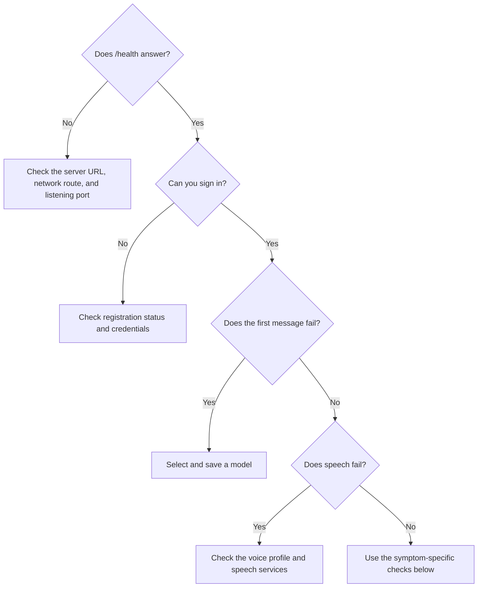

# Troubleshooting



## A client cannot connect

The URL or network route is wrong, or the API is not listening. From the client machine, run:

```bash
curl http://<server>:15597/health
```

Expect `{"status":"ok","service":"llm-hub"}`. On a phone, `localhost` is the phone. Use the server's LAN address.

## The first message fails

The account has no model selected. On desktop, open **Settings → Assistant**. On Android, open **Assistant** from the drawer. Select a model and save.

## “Registration is closed”

This is the default. Sign in as `admin`, or set `ALLOW_REGISTRATION=true` in `backend/.env` and apply it from `backend/`:

```bash
docker compose up -d
```

## The model list is empty

The server cannot reach the model provider. `LLM_API_URL` must be reachable from inside the API container. An unreachable Ollama currently produces an empty list instead of an error.

On Linux, a stock Ollama usually listens only on loopback. Run it with:

```bash
OLLAMA_HOST=0.0.0.0 ollama serve
```

Then refresh the picker. See [Ollama setup](install-server.md#ollama-on-linux) for service installations and old-server limitations.

## The server will not start

Read the API log:

```bash
docker compose logs api
```

Compose names a missing database credential before starting. If PostgreSQL is unreachable, the API prints the database error and gives up after about two minutes.

## Speech does nothing

The voice profile is off by default. Start it from `backend/`:

```bash
docker compose --profile voice up -d
```

Without it, ASR and TTS return HTTP 502. The TTS picker may still show three fallback model names. See [Voice](voice.md) for the external projects and GPU requirement.

## “Update required”

The client and server wire protocol numbers differ. There is no way past this screen. Install a matching client or deploy a matching server.
