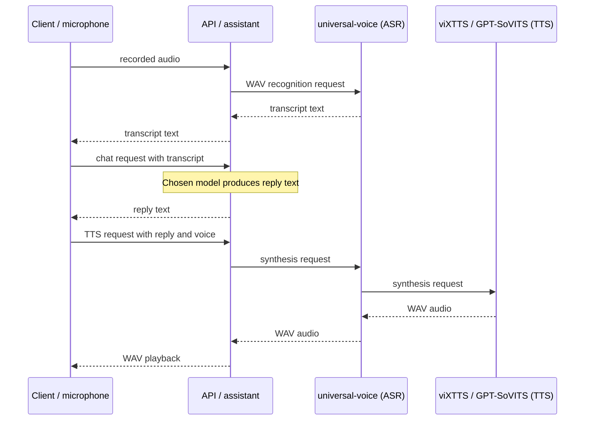

# Voice

Text chat does not need the voice profile. Without a running speech service, ASR endpoints and `POST /tts` return HTTP 502 with **The speech service is unavailable.**

The TTS model picker can still show `vixtts`, `gpt-sovits`, and `vieneu:turbo` while the service is down. A populated picker does not prove that speech works.

## A voice turn



The client records audio and performs voice-activity detection. The API proxies speech requests to `universal-voice`, which handles recognition and fronts synthesis. viXTTS is the normal synthesis backend; GPT-SoVITS is optional.

## Local speech prerequisites

Local speech needs an NVIDIA GPU, the NVIDIA container runtime, and two external trees:

- `UVOICE_ROOT` points to a checkout of [universal-asr](https://github.com/Khoality-dev/universal-asr).
- `VIXTTS_ROOT` points to a tree this project does not distribute. The model is published as [capleaf/viXTTS](https://huggingface.co/capleaf/viXTTS), but the Compose build expects a `vixtts/` directory containing a Dockerfile, beside `models/` and `hf-cache/` directories.

If either path is missing, the profile build fails with a path such as `/VIXTTS_ROOT-is-not-set` or `/UVOICE_ROOT-is-not-set`. Cloud LLM providers remain the supported way to run text chat without these speech trees; they do not provide speech for this stack.

Speech images use about 21.4 GB together. The default Whisper model cache adds about 700 MB, plus whatever viXTTS downloads.

Set the two paths in `backend/.env`, then, from `backend/`, run:

```bash
docker compose --profile voice up -d
```

For the second synthesis backend:

```bash
docker compose --profile voice --profile sovits up -d
```

## Client setup

Select the ASR mode/language and TTS backend under **TTS & ASR**. A persona owns its selected voice; the assistant owns the wake word. Enable automatic playback or always-listening behaviour only when you want the corresponding microphone and speaker activity.

If speech is silent, use the checks in [Troubleshooting](troubleshooting.md).
