# Screens

A walkthrough of the clients, built around the model they present: **one assistant, many personas,
and sub-agents it calls**.

Every screenshot below is generated from fixture data — invented personas, invented transcripts — and
never from a real install. See [Regenerating these](#regenerating-these) at the bottom.

---

## The model, in one sentence

A **persona** is how the assistant sounds. The **assistant** is what it can do. Switching persona
changes who answers; it never changes the model, the tools or the memory.

| | Owns | Count |
| --- | --- | --- |
| **Assistant** | model, provider, tool set, reasoning, memory, voice wake word | exactly one per account |
| **Persona** | name, description, system prompt, preferred name, voice, avatar, character config | as many as you like |
| **Sub-agent** | its own model and tools — a task-only worker, no identity, no memory | as many as you like |

---

## Android

### Chats

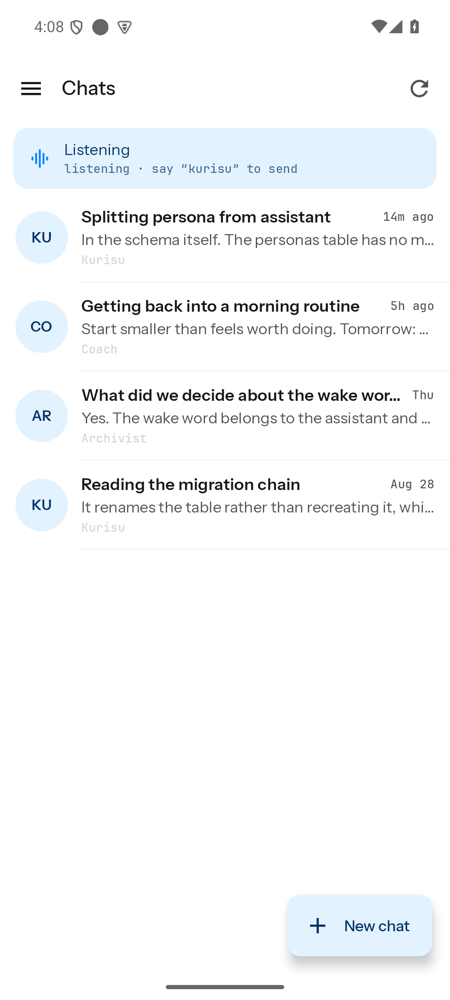

Conversations are what you navigate. Each row shows the persona that is answering it — the assistant's
model is deliberately *not* shown, because it is the same on every row and would say nothing.

The strip at the top is voice state. The wake word (`kurisu` here) belongs to the assistant, not to any
persona: saying it starts a turn, and whichever persona the conversation is bound to answers.

### A conversation

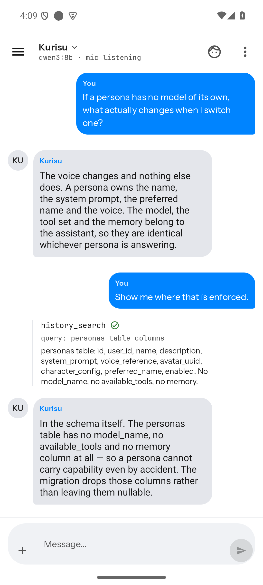

The header names the **persona**, with the assistant's model on the line beneath it. Each answer carries
the persona that produced it, so switching persona part-way through does not rewrite the past — old
answers keep the voice that actually gave them.

A tool call is a rail, not a bubble: name, arguments, result, and a status. A step delegated to a
sub-agent is tagged `sub-agent` and names the model that ran it.

### Switching persona for one conversation

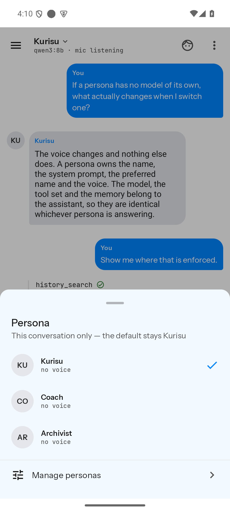

Tapping the header swaps the persona **for this conversation only** — the account default is untouched,
and the change persists without sending a message.

### Assistant

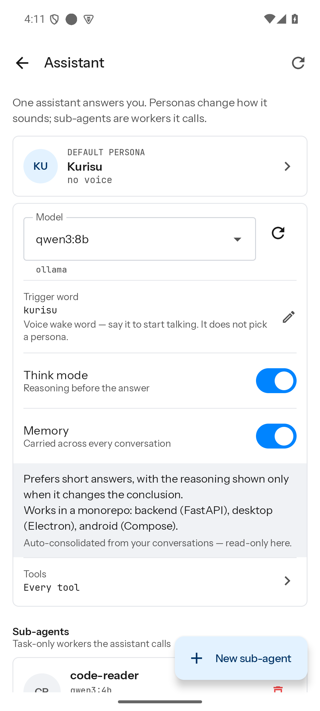

One screen for everything the assistant can do. The default persona is the one every new conversation
silently starts with. Memory is a single document, consolidated automatically from your conversations
and read-only here. Sub-agents live at the bottom, because they are workers this assistant calls rather
than something you chat with.

### Personas

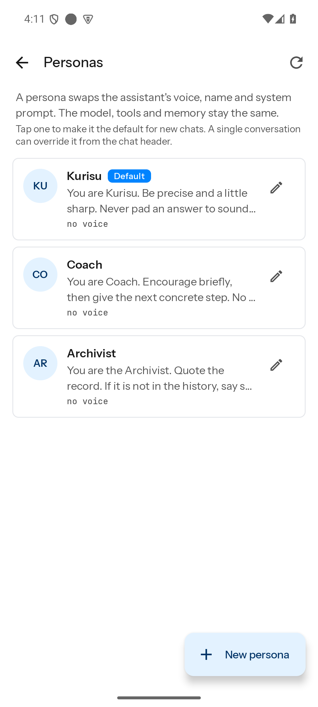
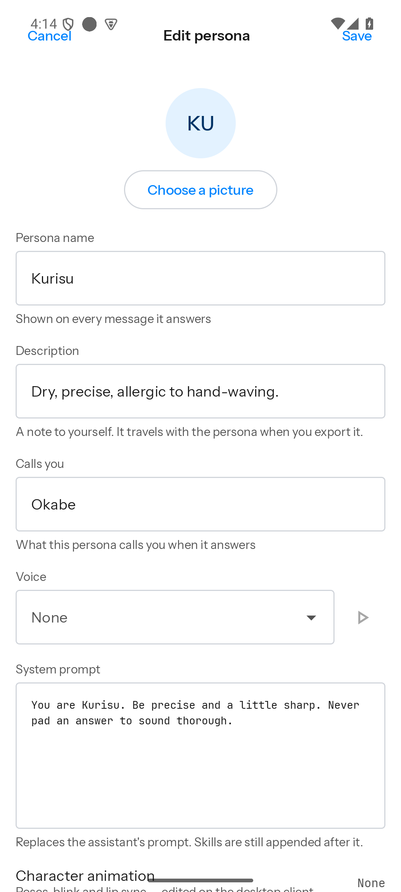

A persona carries presentation only — note there is no model, no tool list and no wake word in the
editor. "Calls you" is what the persona calls *you*, not a display name for the persona.

### Everything else

| | |
| --- | --- |
| 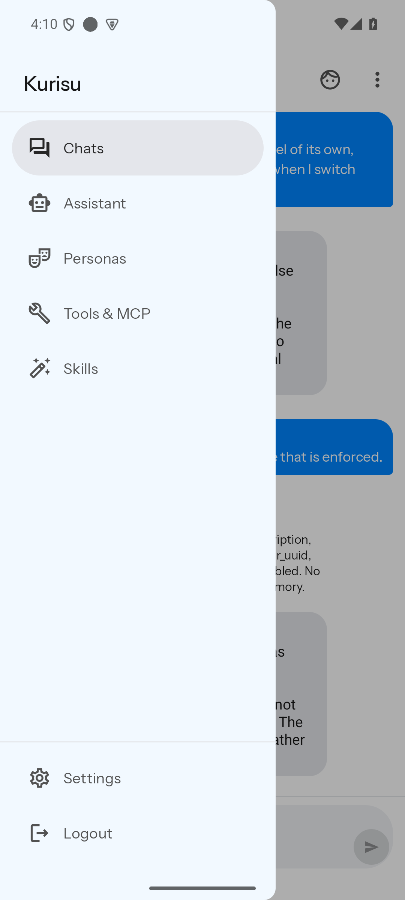 | 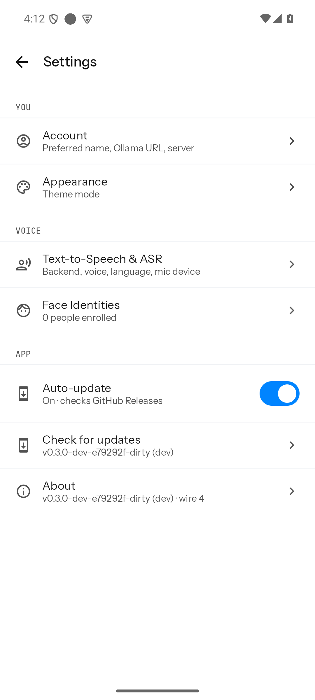 |
| Navigation | Settings |
| 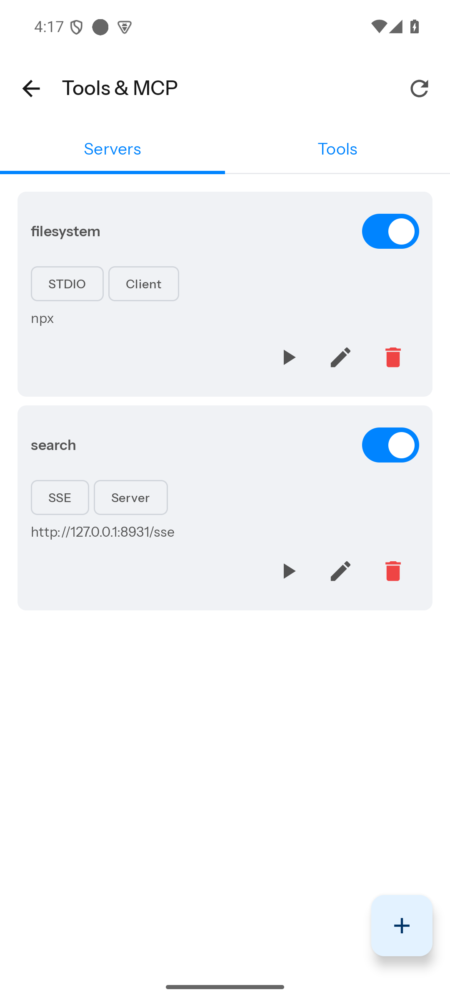 | 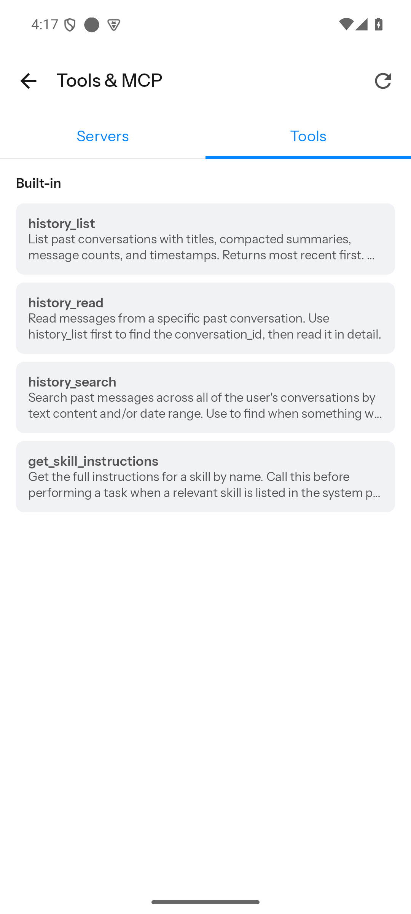 |
| MCP servers, by transport and location | Tools, split built-in from MCP |
| 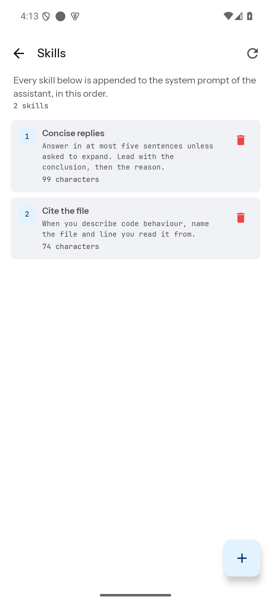 | 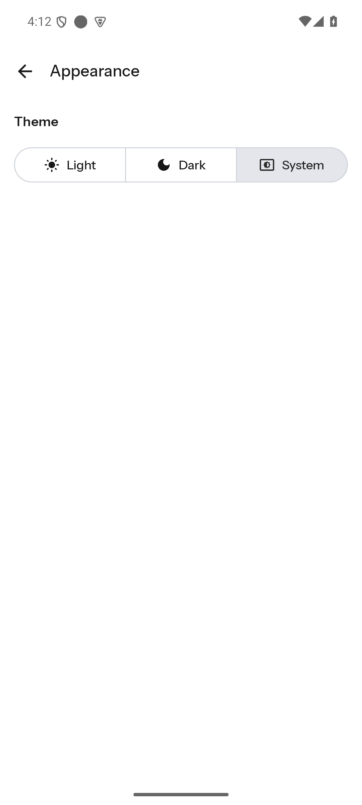 |
| Skills, appended to the assistant's prompt | Light / dark / system |

---

## Desktop

The desktop presents the same model. It is not part of the v3 visual redesign — only the split.

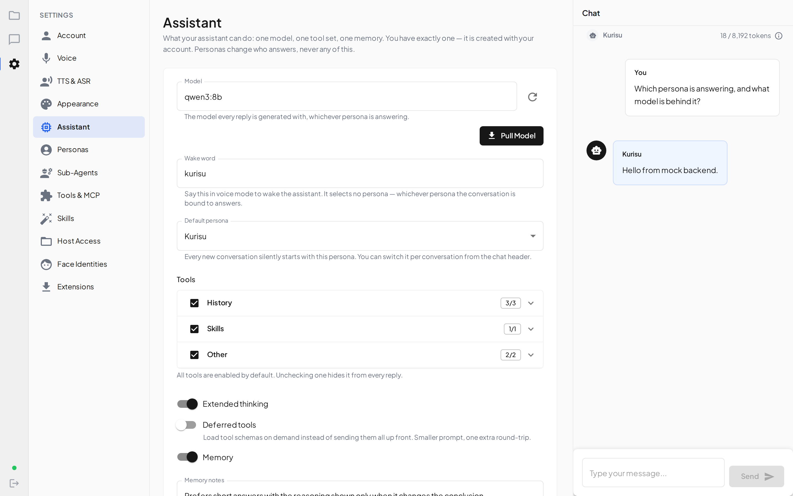

Where there was a single "Agents" section there are now three: **Assistant**, **Personas** and
**Sub-Agents** — because capability, presentation and task-only workers are three different things.

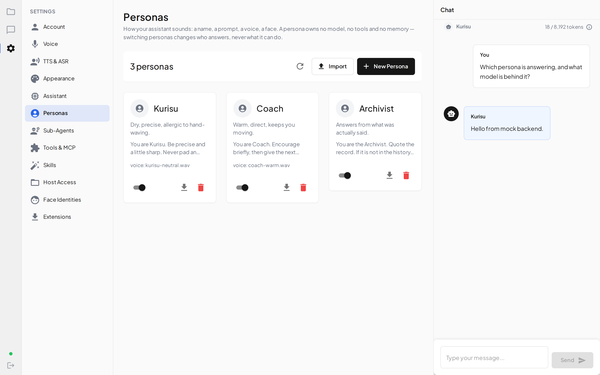
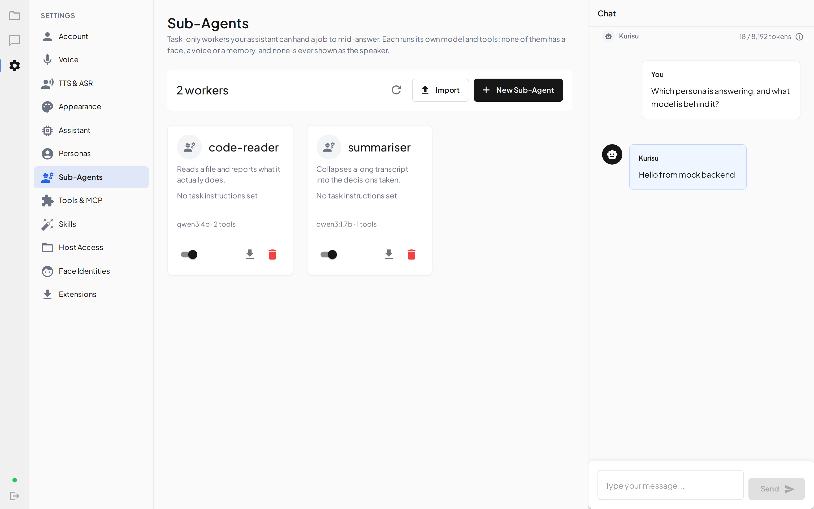

| | |
| --- | --- |
|  | 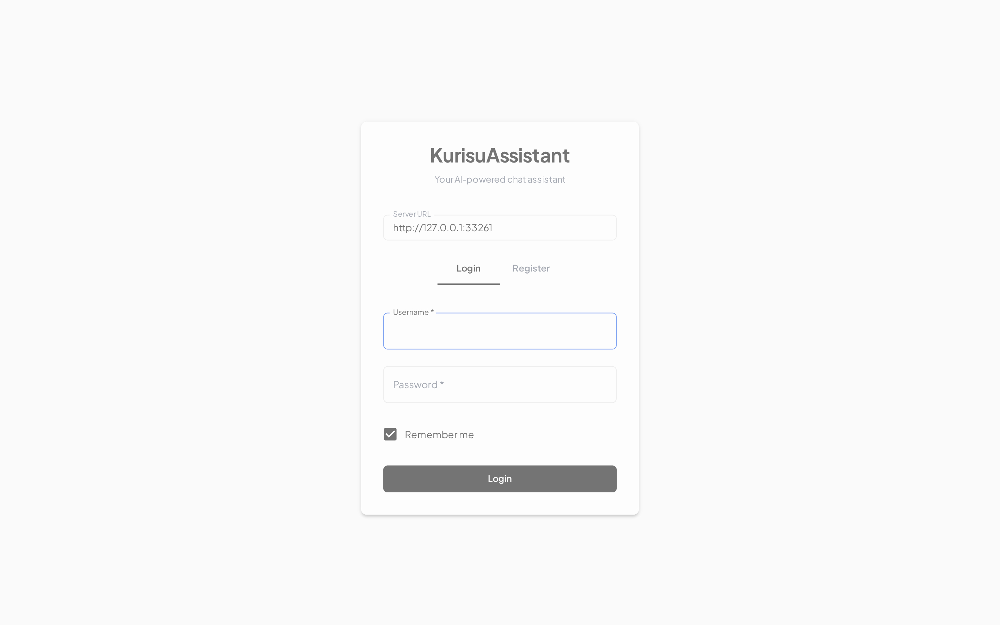 |
| Chat | Sign in |
|  | 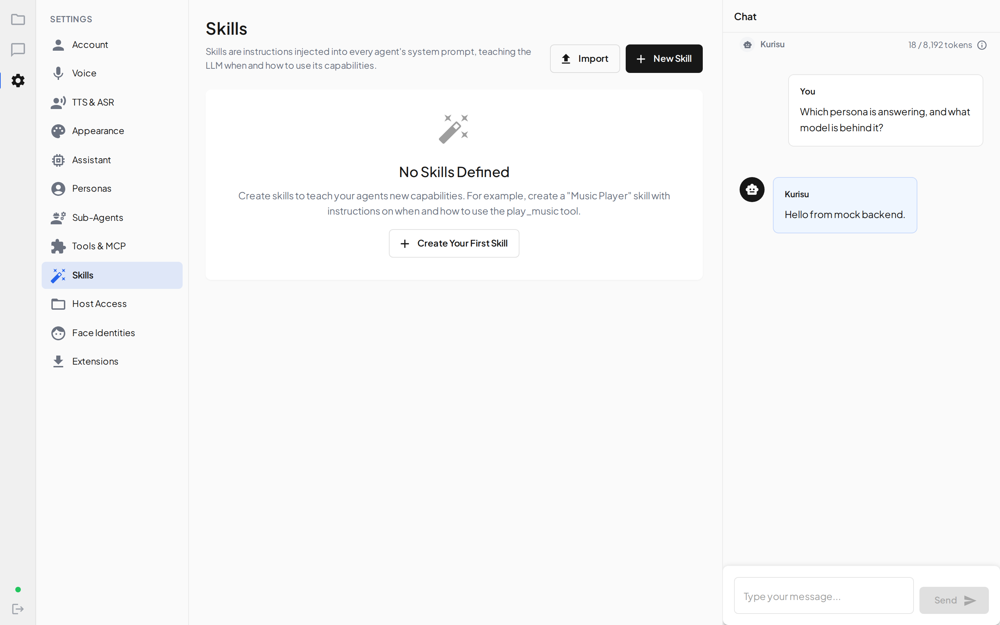 |
| Tools & MCP | Skills |

---

## Regenerating these

Both sets come from fixtures, so they can be regenerated without touching real data.

**Desktop** — renders the built renderer in headless Chromium against the mock backend in
`clients/desktop/tests/mock/server.ts`:

```bash
cd clients/desktop
npx vite build
npx playwright test -c playwright.screenshots.config.ts
```

The capture lives in `tests/screenshots/capture.screens.ts`. It is deliberately not a `*.spec.ts`, so
`npm run test:e2e` never picks it up.

**Android** — needs an emulator and a backend holding fixture content. Run the backend from a *copy* of
`backend/`, not the working tree: `core/paths.py` resolves `data/` from the source tree, so a real run
would read and write the live data directory.

```bash
emulator -avd <avd> -no-window -no-audio -no-boot-anim -gpu swiftshader_indirect
adb install -r -g app/build/outputs/apk/dev/debug/*.apk
adb exec-out screencap -p > shot.png
```

Point the app at `http://10.0.2.2:<port>` — the emulator's route to the host.
